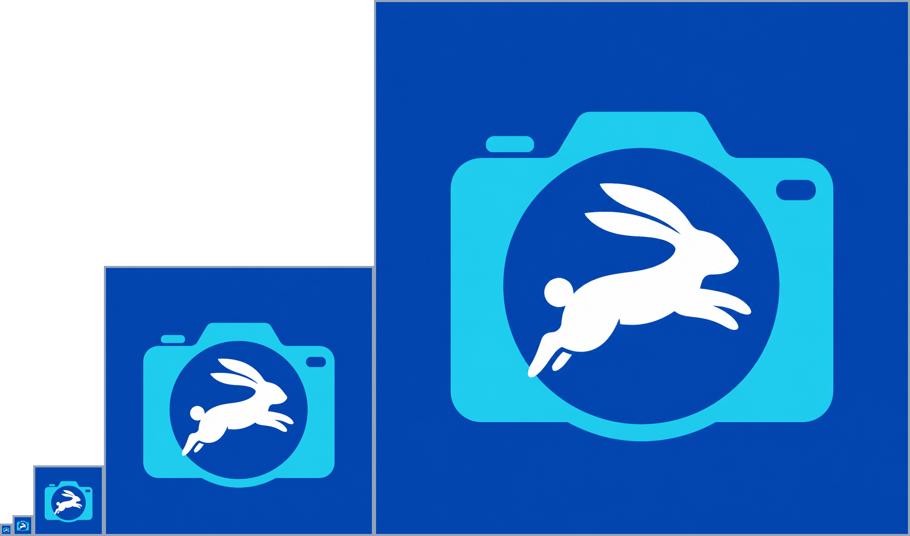
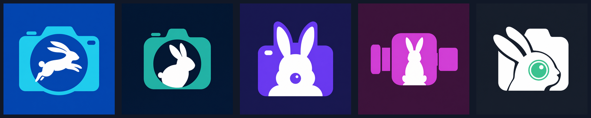
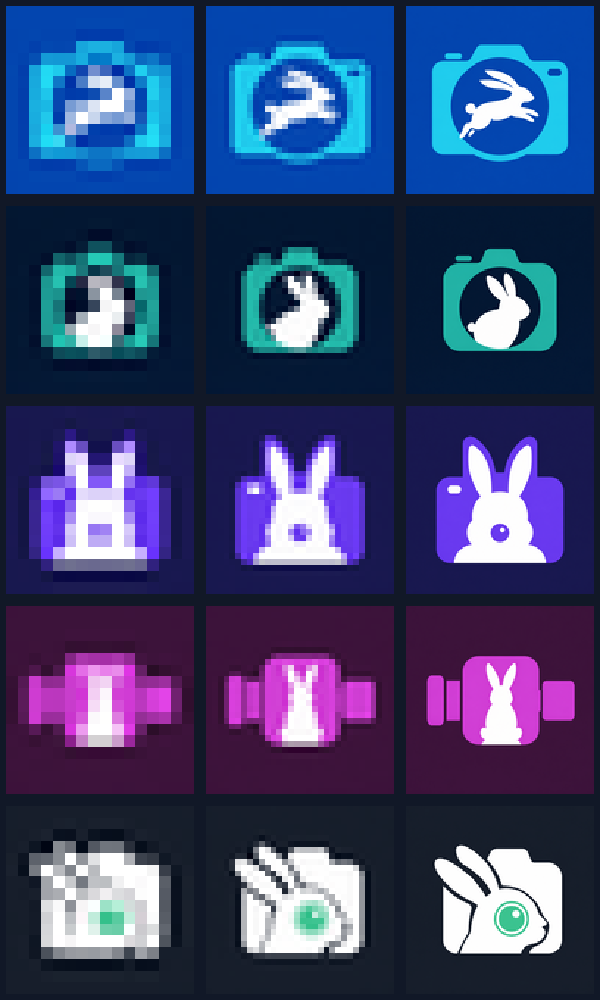

# Grab Rabbit visual identity — decision package

- Decision item: [#17](https://github.com/timharris707/grab-rabbit/issues/17)
- Decision status: Tim selected **Lens Leap (Direction A)** as the visual direction.
- Implementation status: not started; this package does not change application code or shipped assets.
- Production caveat: the selected raster is concept artwork. Production asset work should preserve it visually while rebuilding deterministic exports and verifying every macOS icon size.

## Selected direction — A: Lens Leap

The selected mark is a cyan compact camera with a cobalt lens and a solid white
right-facing leaping rabbit. It is camera-first, energetic, original, contains no
text, and does not use CodeRabbit's orange, robot/circuit cues, rabbit drawing,
enclosing shape, or overall composition.

Files:

- Canonical 1024 master: [`masters/selected-lens-leap.png`](masters/selected-lens-leap.png)
- Required previews: [`previews/selected-lens-leap/`](previews/selected-lens-leap/)
- Exact generation and attempted optical-edit prompts: [`prompts.md`](prompts.md)

The canonical master and its 1024 preview are byte-identical, SHA-256
`d3fe2e13ab745ce47dbb990ee9e42b35b17f64c2dd7084d21ab2e0399cfa1895`.
The 128 and 512 previews are unchanged proportional downscales. At 32 px, camera,
paired ears, leaping body, and round tail remain visible. At 16 px, the overall
camera/rabbit gesture remains visible, but the thin legs and paws merge. A single
authorized optical-size edit was attempted; OpenRouter's edit endpoint returned
`404 Not Found`, so the approved art remains unchanged and the limit is recorded
rather than hidden or retried.

### Selected production palette

The selected output intentionally uses a restrained gradient. Values below are
representative exact sRGB samples from the canonical 1024 raster and are the
recommended production tokens:

| Token | Value | Use |
|---|---|---|
| `field-start` | `#0346AC` | Cobalt field, top/center |
| `field-end` | `#0749A3` | Cobalt field, outer corners |
| `lens-start` | `#0244AE` | Lens/depth dark stop |
| `lens-end` | `#074AB0` | Lens/depth light stop |
| `camera-cyan` | `#1FCCEE` | Camera body |
| `rabbit-white` | `#FEFEFE` | Rabbit silhouette |

The generated raster includes antialiasing and small interpolation variations;
the canonical master remains authoritative until deterministic production art is
approved.

## Explored alternatives

Contact-sheet order: selected Lens Leap, Burrow Cutout, Viewfinder Ears,
Camcorder Sentinel, Focus Eye.

Small-size inspection rows use the same order; columns are 16, 32, and 128 px,
shown with nearest-neighbor enlargement so lost detail remains visible.

| Direction | Intended exact palette | Small-size result | Decision |
|---|---|---|---|
| A — Lens Leap | Cobalt `#164EAE`, cyan `#22D3EE`, white `#FFFFFF`; selected raster samples above | Strong at 128; readable at 32; thin limbs merge at 16 | **Selected by Tim** |
| B — Burrow Cutout | Navy `#0B1F33`, teal `#12B8A6`, white `#FFFFFF` | Camera remains clear; rabbit collapses toward a white seated blob at 16 | Rejected; less energetic and weaker at 16 |
| C — Viewfinder Ears | Indigo `#1E1B4B`, violet `#7C3AED`, white `#FFFFFF` | Bold ears survive, but camera/rabbit merges into a mascot-like face | Rejected; less distinctive and more character-like |
| D — Camcorder Sentinel | Plum `#3B163C`, magenta `#D946EF`, white `#FFFFFF` | Camcorder survives; rabbit becomes a vertical white column at 16/32 | Rejected; rabbit ambiguity |
| E — Focus Eye | Graphite `#18202A`, mint `#34D399`, white `#FFFFFF` | Lens survives; rabbit and camera contours fuse at 16 | Rejected; weakest two-subject read |

All five generated concepts stayed non-orange, text-free, camera-centered, and
visually separate from CodeRabbit trade dress. Every generation introduced some
gradient despite the original flat-color constraint. Tim explicitly selected the
Lens Leap rendering as shown, so its gradient is an accepted part of Direction A;
the other outputs remain rejected exploration only.

## Recommended bundle identifier

Recommend **`dev.clickai.grabrabbit`**, subject to the final Apple Developer
availability check.

Evidence and limits:

- Tim's public [GitHub profile](https://github.com/timharris707) links
  [`clickai.dev`](https://clickai.dev), and the Grab Rabbit repository is owned by
  that GitHub account.
- On 2026-08-14, `clickai.dev` resolved in DNS and returned HTTP 200 over HTTPS.
- The current app still uses upstream `com.lihaoyun6.QuickRecorder`; it must not be
  retained for a distributed Grab Rabbit build.
- Bundle-ID uniqueness is ultimately enforced inside Apple's Certificates,
  Identifiers & Profiles service and cannot be proven from public web or repository
  searches. Tim must confirm control of `clickai.dev` and register/check
  `dev.clickai.grabrabbit` in the intended Apple Developer team before application
  implementation. Nothing was registered during this decision package.

## Production regression checks

The implementation issue should make these checks repeatable:

1. Export all required macOS icon sizes from deterministic source artwork and fail if dimensions, color profile, or alpha behavior drift.
2. Compare 16 and 32 px golden images so rabbit ears, round tail, and camera outline cannot silently regress into ambiguous blobs.
3. Assert the shipped asset catalog contains only the approved Lens Leap direction and the expected size slots.
4. Inspect the built app's icon at 1× and 2× on both light and dark macOS surfaces.
5. Verify the final bundle identifier and document UTI identifiers use the Apple-registered Grab Rabbit namespace, never the upstream identity.
