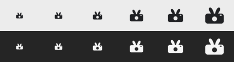
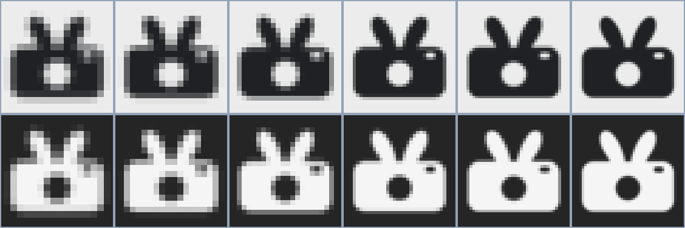
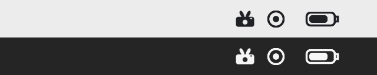

# Grab Rabbit menu-bar status-item template

- Decision item: [#17](https://github.com/timharris707/grab-rabbit/issues/17)
- Approved relationship: full-color Lens Leap app icon plus a simplified monochrome Viewfinder Ears status companion.
- Package status: production-quality vector source ready for Tim's final issue sign-off; not installed in the application.

## Recommended status mark



The refined mark keeps Viewfinder Ears' core family cue: one compact rounded camera
body whose top becomes a pair of unmistakable rabbit ears. Its right-side
viewfinder, centered negative-space lens, horizontal body, corner language, and
camera-first read make it a deliberate companion to Lens Leap without shrinking the
detailed full-color app artwork into the menu bar.

The final glyph is hand-built Bézier geometry, not an auto-traced raster. Compared
with the 2048 reference, its ears are shorter and broader, its padding is balanced,
and its two cutouts are sized to remain open at menu-bar scale. It contains no
background, text, gradient, embedded raster, or chroma-derived edge.

## Deliverables

- Editable canonical SVG: [`source/grab-rabbit-status-template.svg`](source/grab-rabbit-status-template.svg), SHA-256 `288ed821699795029c55aac1a2ddde32b1792c4dc943ee97780331ae7d027f16`
- Editable 1× optical SVG: [`source/grab-rabbit-status-template-optical-1x.svg`](source/grab-rabbit-status-template-optical-1x.svg), SHA-256 `6bf38a65534b70ed1a01e617806d6c115b56474eecf3fb1229cd6edbb2a8991e`
- Canonical transparent PNG: [`master/grab-rabbit-status-template-1024.png`](master/grab-rabbit-status-template-1024.png), SHA-256 `0a62b877774e0d6f8a402e51486a30e1d4f360562c6b2820f2b82189dfc79cbc`
- True-vector 18-point PDF: [`master/grab-rabbit-status-template.pdf`](master/grab-rabbit-status-template.pdf), SHA-256 `6ddf7ecccdb49db255dcef905a19a013022f890810c5f437f0ae0fd587be0d5b`
- Exact PNG exports: [`exports/`](exports/)
- Light/dark menu-bar comparison: [`previews/menu-bar-comparison.png`](previews/menu-bar-comparison.png)
- Pixel-level inspection sheet: [`previews/pixel-inspection.png`](previews/pixel-inspection.png)
- Deterministic derivation: [`derive-status-icon.sh`](derive-status-icon.sh)

| Asset | Pixels | Geometry | SHA-256 |
|---|---:|---|---|
| `grab-rabbit-status-16pt.png` | 16 × 16 | 1× optical | `f4d92402e4f7e4ebcc089cb83422e02fb5658975356eb4d277691ab6d504434b` |
| `grab-rabbit-status-18pt.png` | 18 × 18 | 1× optical | `eed9a32d72804a4a96fd2e321b19c51503a2b48d2c12b07e122accc41b28828f` |
| `grab-rabbit-status-22pt.png` | 22 × 22 | 1× optical | `f2fb0912d7958806955a6d36bc857dec042be9b103ba63ecb427fd2b0f146542` |
| `grab-rabbit-status-16pt@2x.png` | 32 × 32 | canonical | `f8e93af722f2e13b0e17b8105ee2f90e483877f967fa940394a122ce8163d9cb` |
| `grab-rabbit-status-18pt@2x.png` | 36 × 36 | canonical | `4271076389e5cc1df1e417f517e4face4609e1ae56ebbdb153b6899a1972fab1` |
| `grab-rabbit-status-22pt@2x.png` | 44 × 44 | canonical | `d8a7573658de80c3fda029f1d110269c750499c0e78a80b4b2173510188d027c` |

## Deterministic vector derivation

Run from anywhere inside the repository:

```bash
docs/design/visual-identity/status-item/derive-status-icon.sh
```

The script makes no API or model call. It:

1. Renders the canonical SVG to the transparent 1024 PNG master.
2. Renders 32, 36, and 44-pixel Retina PNGs directly from canonical Bézier geometry.
3. Renders 16, 18, and 22-pixel PNGs from the 1× optical SVG. That variant preserves the outer silhouette while enlarging the lens radius from 118 to 128 units and the viewfinder from 96 × 56 to 112 × 64 units so neither cutout collapses.
4. Converts the canonical SVG paths into a deterministic 18 × 18-point ReportLab PDF using even-odd vector fills. The PDF contains two paths and zero embedded images or fonts.
5. Generates exact-size, nearest-neighbor inspection, and representative light/dark menu-bar previews.
6. Strips date/time chunks from every final PNG so repeated runs remain byte-identical.

## Reference provenance

The source concept and its locally chroma-removed derivative are retained under
[`references/`](references/) for auditability only. They are not shippable assets:

| Reference | SHA-256 |
|---|---|
| `grab-rabbit-viewfinder-ears-gpt-image-2-v2.png` | `32e409950273f6b75d937fd2e475a8a4d0ec4d0274af58be7e4bc790818ab196` |
| `grab-rabbit-viewfinder-ears-gpt-image-2-v2-transparent.png` | `bf3abd7280195f3b8db513abf3d516b13e298e57fc8ba2f6aaf7ad3fa0cd669c` |

Exactly one authorized `gpt-image-2` generation produced the 2048/high reference.
The exact prompt, invocation route, 103.2-second duration, chroma-removal command,
and pixel counts are preserved in [`../prompts.md`](../prompts.md). No additional
generation or edit call was made during the vector rebuild.

## QA results



- The canonical PNG and all six exports use one black RGB color plus alpha. Green-channel maximum is zero, proving the shipping candidates contain no chroma fringe.
- Visible master bounds are 881 × 775 at `(72,126)`, leaving 72 px left, 71 px right, 126 px top, and 123 px bottom. The optical center is balanced and the ears consume less than half the visible height.
- At 16, 18, 22, 32, 36, and 44 pixels the horizontal camera body, two separated ears, centered lens, and right-side viewfinder remain distinguishable. The 1× exports use enlarged negative detail; Retina exports preserve canonical proportions.
- Exact-size rasters are direct vector renders, avoiding the green edge, blur, and irregular contour of raster tracing or chroma-key downscaling.
- Light previews tint the template near-black (`#202124`); dark previews tint it near-white (`#F5F5F5`). Neither display color is baked into the template master.
- The one-page PDF is 18 × 18 points. `pdfimages -list` reports zero raster images and `pdffonts` reports zero font resources; a PDF-to-SVG round trip contains two paths and zero image elements. Poppler rendered it at 144 dpi as a clean 36 × 36 mark.
- Two consecutive clean derivations produce byte-identical PNG/PDF hashes.



Final integration must set the status artwork as a macOS template image and retest it
inside the built application. [Issue #18](https://github.com/timharris707/grab-rabbit/issues/18)
owns asset installation; [issue #20](https://github.com/timharris707/grab-rabbit/issues/20)
owns status behavior and controls. This package makes neither change.
